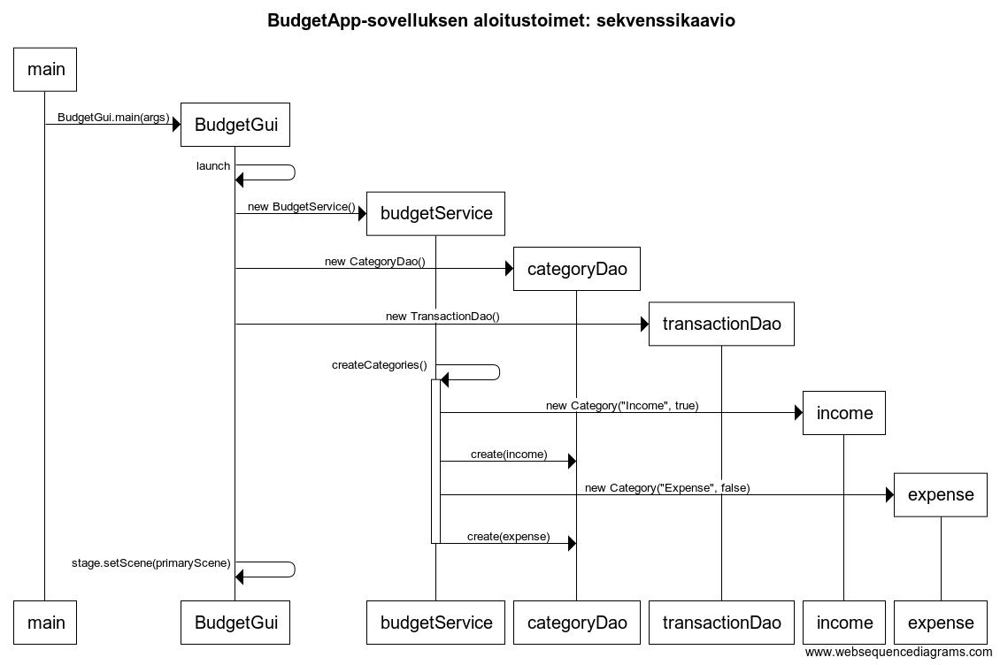
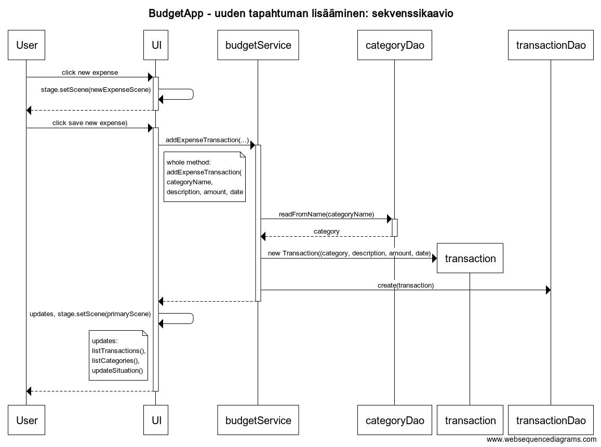

# Arkkitehtuurikuvaus

## Rakenne
Ohjelman rakenne noudattelee kolmitasoista kerrosarkkitehtuuria. Koodissa on kolme pakkausta seuraavanlaisessa pakkausrakenteessa:

Pakkaus budgetapp.ui sisältää JavaFX:llä toteutetun käyttöliittymän sekä main-metodin sovelluksen käynnistämiseen. Pakkaus budgetapp.domain sisältää sovelluslogiikan ja sovellukset datamallin muodostavat luokat. Pakkaus budgetapp.dao sisältää tietojen pysyväistalletuksesta vastaavat luokat skeä rajapinnat näiden luokkien ja sovelluslogiikan väliin. 

## Sovelluslogiikka
Sovelluksen loogisen datamallin muodostavat luokat [Category](/BudgetApp/src/main/java/budgetapp/domain/Category.java) ja [Transaction](/BudgetApp/src/main/java/budgetapp/domain/Transaction.java), jotka kuvaavat tulojen ja menojen kategorioita ja niihin liittyviä tilitapahtumia. 

Sovelluksen toimintaa hoitaa luokka [BudgetService](/BudgetApp/src/main/java/budgetapp/domain/BudgetService.java), josta luotava olio tarjoaa käyttöliittymän toiminnoille metodit, ja yhdistää käyttäjän käyttöliittymässä antamat komennot ja tiedot tietokantaa käyttäviin luokkiin ja sitä kautta tietokantaan. 

BudgetService tarjoaa käyttöliittymälle seuraavat metodit: 
* List listTransactionsFromCategory(Category category)
* List listTransactionsInDateOrder()
* List listAllCategories()
* List listExpenseCategories()
* void addIncomeTransaction(String description, int amount, LocalDate date)
* void addExpenseTransaction(Category category, String description, int amount, LocalDate date)
* void editIncomeTransaction(Integer key, String description, int amount, LocalDate date)
* void editExpenseTransaction(Integer key, Category category, String description, int amount, LocalDate date)
* void deleteTransaction(Integer key)
* int getIncomeSum()
* int getExpensesSum()
* int getBalance()
* int getCategorySum(Category category).

Lisäksi BudgetService luokassa on metodit sovelluksen valmiiden kategorioiden luomiseen sovelluksen käynnistyksen yhteydessä. Käytännössä sovellus tallentaa kategoriat tietokantaan sovelluksen käytettäväksi ensimmäisen käynnistyksen yhteydessä, tai jos tietokanta tai kategorioita on välissä poistettu niin se tallentaa ne uudelleen. 
 
BudgetService pääsee käsiksi tietojen tallentamiseen ja hakemiseen pakkauksessa budgetapp.dao sijaitsevien rajapinnat [CategoryDao](/BudgetApp/src/main/java/budgetapp/dao/CategoryDao.java) ja [TransactionDao](/BudgetApp/src/main/java/budgetapp/dao/TransactionDao.java) toteuttavien luokkien kautta. Luokat injektoidaan sovelluslogiikalle BudgetService-luokan konstruktorikutsun yhteydessä. 

Sovelluslogiikasta vastaavan BudgetService-luokan ja ohjelman muiden osien suhdetta kuvaa seuraava luokka-/pakkauskaavio:

## Tietojen pysyväistallennus
Pakkauksen budgetapp.dao luokkien [SQLCategoryDao](/BudgetApp/src/main/java/budgetapp/dao/SQLCategoryDao.java) ja [SQLTransactionDao](/BudgetApp/src/main/java/budgetapp/dao/SQLTransactionDao.java) vastuulla on tietokannan käyttäminen eli tietojen tallentaminen tietokantaan ja tietojen haku tietokannasta. Luokat noudattavat Data Access Object -suunnittelumallia. Sovelluslogiikka käyttää luokkia rajapintojen CategoryDao ja TransactionDao kautta, eikä sillä ole suoraa pääsyä SQL-Dao-luokkiin. Edellämainitut rajapinnat toteuttavat luokat voidaan korvata uusilla luokilla, jos tietojen tallennustapa halutaan vaihtaa esimerkiksi tiedostoiksi. 

Rajapintoja hyödynnetään myös sovelluslogiikan testauksessa, sillä sovelluslogiikan testeissä ei käytetä tietokantaan tallentavia luokkia, vaan niistä tehtyjä jäljitelmiä, jotka tallentavat tiedot vain testien ajaksi keskusmuistiin. 

### Tietokanta
Sovellus tallentaa kategorioiden ja tilitapahtumien tiedot tietokantaan. Oletuksena sovellus käyttää H2-tietokantaa, joka on määritelty sovelluksen juureen sijoitetussa konfiguraatiotiedostossa [config.properties](/BudgetApp/config.properties). Tietokannan voi vaihtaa antamalla konfiguraatiotiedostossa uudet tiedot.

Sovellus luo tietokannan, jos sitä ei vielä ole olemassa, sekä luo sinne tarvittavat taulut Category ja Transaction. 

## Päätoiminnallisuudet
Sovelluksen toimintalogiikkaa kuvataan joidenkin päätoiminnallisuuksien osalta seuraavissa sekvenssikaavioissa.

Sovelluksen käynnistymistä kuvaava kaavio:

Uuden kulutapahtuman lisäämistä kuvaava kaavio:

