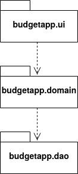
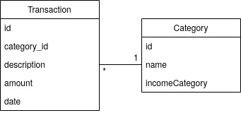
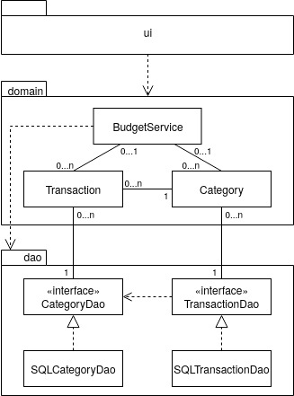
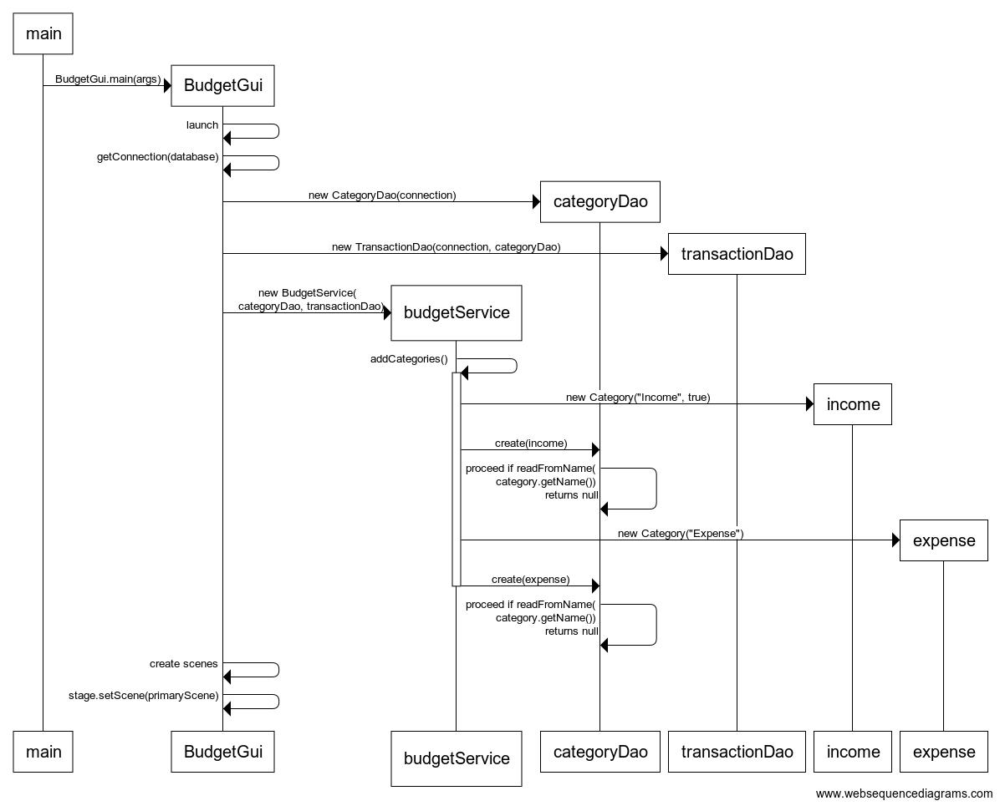
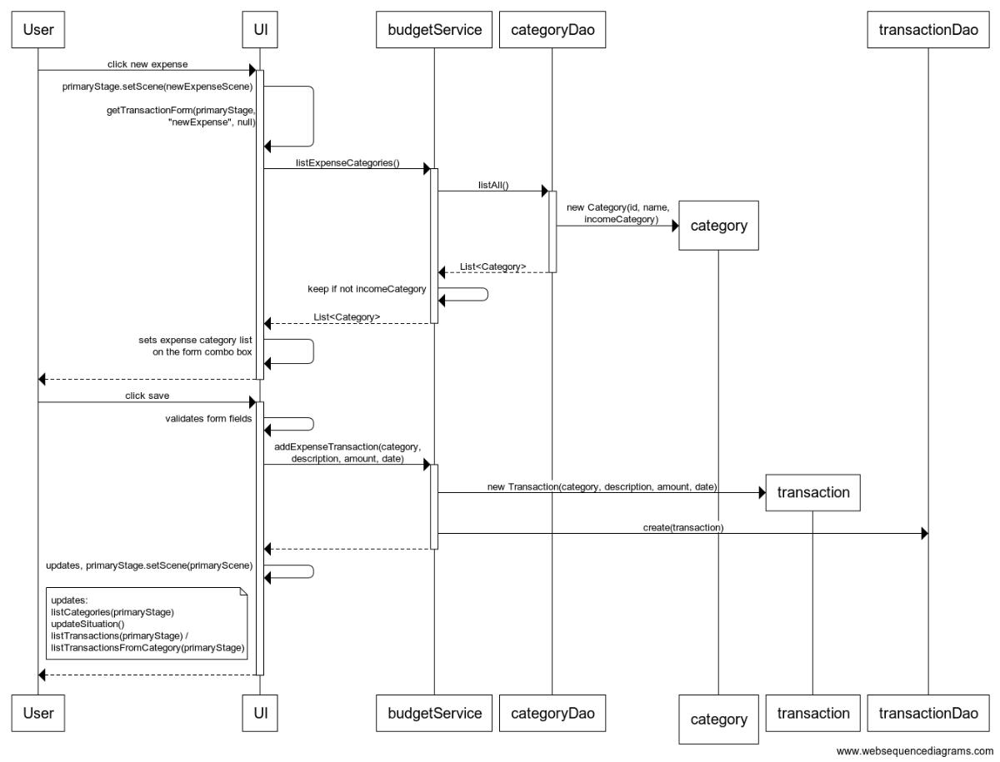
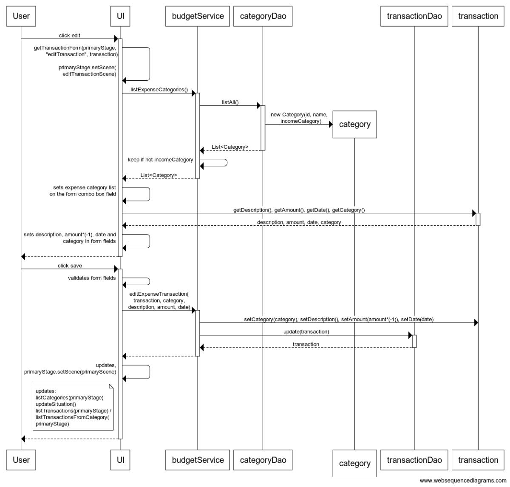

# Arkkitehtuurikuvaus

## Rakenne
Ohjelman rakenne noudattelee kolmitasoista kerrosarkkitehtuuria. Koodin pakkaukset muodostavat seuraavanlaisen pakkausrakenteen:

Pakkaus budgetapp.ui sisältää JavaFX:llä toteutetun käyttöliittymän. Pakkaus budgetapp.domain sisältää sovelluslogiikan ja sovellukset datamallin muodostavat luokat. Pakkaus budgetapp.dao sisältää tietojen pysyväistalletuksesta vastaavat luokat skeä rajapinnat näiden luokkien ja sovelluslogiikan väliin. Main-metodi sovelluksen käynnistämiseen on tallennettu pakkaukset sisältävän pakkauksen juureen budgetapp.

## Käyttöliittymä
Sovelluksella on graafinen käyttöliittymä, joka on toteutettu JavaFX:ää käyttäen luokkaan budgetapp.ui.BudgetGui.

Käyttöliittymässä on neljä näkymää:
* aloitusnäkymä
* tapahtumalistaus kaikille tapahtumille tai yhden kategorian tapahtumille
* uuden tulotapahtuman lisääminen tai tulotapahtuman muokkaaminen
* uuden menotapahtuman lisääminen tai menotapahtuman muokkaaminen.

Näkymistä aloitusnäkymä ja tapahtumalistaus ovat sijoitettuna samaan Scene-olioon, jonka yläreunassa on siirtymävalikko eri näkymiin, ja keskellä vaihtuva näkymä joko aloitusnäkymälle tai tapahtumalistaukselle. Tapahtumalistauksesta on kaksi versiota, joista toisessa ohjelma hakee näkyviin kaikki tallennetut tapahtumat, ja toisessa ohjelma hakee näkyviin valitun kategorian tapahtumat. Tapahtumien lisäys-/muokkauslomakkeet ovat kumpikin oma Scene-olionsa, joissa ei ole yläreunan siirtymävalikkoa, vaan lomakkeelta poistutaan edelliseen näkymään joko tallennus- tai peruutuspainikkeella. Lisäyslomakkeilla lomakekentät ovat tyhjinä, ja muokkauslomakkeelle ohjelma hakee lomakekenttiin pohjaksi muokattavalle tapahtumalle viimeksi tallennetut tiedot. Sovelluksen Stagessa on sijoitettuna yksi kolmesta Scene-oliosta kerrallaan. 

Käyttöliittymä on pyritty eristämään sovelluslogiikasta, eikä se huolehdi tietojen tallentamisesta ja tallennetun tiedon hakemisesta. Käyttöliittymä kutsuu näille toiminnoille sovelluslogiikkaa hoitavan luokan BudgetService olion metodeja. Käyttöliittymän vastuulla on näyttää sovelluslogiikan hakemat tiedot käyttöliittymässä määritellyssä muodossa, sekä vastaanottaa käyttäjältä tapahtumia koskevia tietoja niiden tallentamiseksi siirtämistä varten. 

Käyttäjän tallentaessa tapahtuman käyttöliittymä hakee näkyviin muuttuneet tapahtumalistauksen, kategorioiden summat, menojen ja tulojen summat, talouden tasapainon tilanteen sekä menojen jakautumista kuvaavan piiraskaavion tiedot. Tiedot päivittyvät kutsumalla seuraavia metodeja, jotka puolestaan kutsuvat sovelluslogiikasta tarvittavia metodeja hakemaan tietoja tietokannasta:
* updateSituation() aloitusnäkymän talouden tasapainolle, menojen ja tulojen summille ja piiraskaaviolle
* listCategories(Stage) aloitusnäkymän kategorialistaukselle ja sen summille
* listTransactions(Stage), tai listTransactionFromCategory(Category, Stage), jos lomakkeelle on siirrytty yhden kategorian tapahtumalistauksesta, tapahtumalistauksen tiedoille.

Samoja metodeja kutsutaan siirryttäessä näkymästä toiseen, jotta käyttöliittymä hakee näkyviin tuoreimmat näkymän tarvitsemat tiedot. Tällöin ei kuitenkaan kutsuta kaikkia metodeja kerralla, vaan vain siirryttävään näkymään tarvittavia metodeja.

## Sovelluslogiikka
Sovelluksen loogisen datamallin muodostavat luokat [Category](/BudgetApp/src/main/java/budgetapp/domain/Category.java) ja [Transaction](/BudgetApp/src/main/java/budgetapp/domain/Transaction.java), jotka kuvaavat tulojen ja menojen kategorioita ja niihin liittyviä tilitapahtumia. 

Sovelluksen toimintaa hoitaa luokka [BudgetService](/BudgetApp/src/main/java/budgetapp/domain/BudgetService.java), josta luotava olio tarjoaa käyttöliittymän toiminnoille metodit, ja yhdistää käyttäjän käyttöliittymässä antamat komennot ja tiedot tietokantaa käyttäviin luokkiin ja sitä kautta tietokantaan. 

BudgetService tarjoaa käyttöliittymälle seuraavat metodit: 
* List listTransactionsFromCategory(Category category)
* List listTransactions()
* List listAllCategories()
* List listExpenseCategories()
* Category getIncomeCategory()
* void addIncomeTransaction(String description, int amount, LocalDate date)
* void addExpenseTransaction(Category category, String description, int amount, LocalDate date)
* void editIncomeTransaction(Transaction transaction, String description, int amount, LocalDate date)
* void editExpenseTransaction(Transaction transaction, Category category, String description, int amount, LocalDate date)
* void deleteTransaction(Integer key)
* int getIncomeSum()
* int getExpensesSum()
* int getBalance()
* int getCategorySum(Category category)
* ObservableList<PieChart.Data> listCategoryPieChartData().

Lisäksi BudgetService luokassa on metodit sovelluksen valmiiden kategorioiden luomiseen sovelluksen käynnistyksen yhteydessä. Käytännössä sovellus tallentaa kategoriat tietokantaan sovelluksen käytettäväksi ensimmäisen käynnistyksen yhteydessä, tai jos tietokanta tai kategorioita on välissä poistettu niin se tallentaa ne uudelleen. 
 
BudgetService pääsee käsiksi tietojen tallentamiseen ja hakemiseen pakkauksessa budgetapp.dao sijaitsevien rajapinnat [CategoryDao](/BudgetApp/src/main/java/budgetapp/dao/CategoryDao.java) ja [TransactionDao](/BudgetApp/src/main/java/budgetapp/dao/TransactionDao.java) toteuttavien luokkien kautta. Luokat injektoidaan sovelluslogiikalle BudgetService-luokan konstruktorikutsun yhteydessä. 

Sovelluslogiikasta vastaavan BudgetService-luokan ja ohjelman muiden osien suhdetta kuvaa seuraava luokka-/pakkauskaavio:

## Tietojen pysyväistallennus
Pakkauksen budgetapp.dao luokkien [SQLCategoryDao](/BudgetApp/src/main/java/budgetapp/dao/SQLCategoryDao.java) ja [SQLTransactionDao](/BudgetApp/src/main/java/budgetapp/dao/SQLTransactionDao.java) vastuulla on tietokannan käyttäminen eli tietojen tallentaminen tietokantaan ja tietojen haku tietokannasta. Luokat noudattavat Data Access Object -suunnittelumallia. Sovelluslogiikka käyttää luokkia rajapintojen CategoryDao ja TransactionDao kautta, eikä sillä ole suoraa pääsyä SQL-Dao-luokkiin. Edellämainitut rajapinnat toteuttavat luokat voidaan korvata uusilla luokilla, jos tietojen tallennustapa halutaan vaihtaa esimerkiksi tiedostoiksi. 

Rajapintoja hyödynnetään myös sovelluslogiikan testauksessa, sillä sovelluslogiikan testeissä ei käytetä tietokantaan tallentavia luokkia, vaan niistä tehtyjä jäljitelmiä, jotka tallentavat tiedot vain testien ajaksi keskusmuistiin. 

### Tietokanta
Sovellus tallentaa kategorioiden ja tilitapahtumien tiedot tietokantaan. Oletuksena sovellus käyttää H2-tietokantaa, joka on määritelty sovelluksen juureen sijoitetussa konfiguraatiotiedostossa [config.properties](/BudgetApp/config.properties). Tietokannan voi vaihtaa antamalla konfiguraatiotiedostossa uudet tiedot.

Sovellus luo tietokannan, jos sitä ei vielä ole olemassa, sekä luo sinne tarvitsemansa taulut Category ja Transaction. 

## Päätoiminnallisuudet
Sovelluksen toimintalogiikkaa kuvataan joidenkin päätoiminnallisuuksien osalta seuraavissa sekvenssikaavioissa.

### Sovelluksen käynnistyminen
Sovelluksen käynnistäminen aloittaa sovelluksen käynnistymisen ja aloitustoimet, joiden prosessi etenee seuraavasti:

Sovellusta käynnistettäessä main-metodi kutsuu käyttöliittymäluokkaan tehtyä main-metodia, joka puolestaan kutsuu sovelluksen rakentavaa metodia launch. Sovellus hakee käynnistymisen yhteydessä tiedostosta config.properties tietokannan tiedot ja muodostaa yhteyden tietokantaan. Jos tietokantatiedostoa ei ole, niin sovellus luo sen. Lisäksi sovellus luo SQLCategoryDao- ja SQLTransactionDao-luokista oliot, jotka se siirtää sovelluslogiikan käyttöön BudgetService-luokasta luotavalle oliolle konstruktorikutsun parametreina. BudgetService-olion luominen kutsuu luokkansa sisältä metodia addCategories, joka lisää sovellukselle määritellyt kategoriat (yksi tulokategoria ja 12 menokategoriaa) tietokantaan, jos siellä ei ole samannimisiä kategorioita. Käynnistymisen yhteydessä sovellus luo käyttöönsä sovelluksen näkymät ja asettaa käyttöliittymään näkyviin aloitusnäkymän.  

### Uuden menotapahtuman lisääminen

Uuden menotapahtuman lisääminen etenee seuraavasti:

Käyttäjän klikatessa New expense -painiketta aloitus- tai tapahtumalistausnäkymässä tapahtumakäsittelijä asettaa näkyville uuden kulutapahtuman lisäämislomakkeen hakemalla näkymään oikeat lomakekomponentit. Koska kyseessä on meno, niin lomakkeelle haetaan kategoriavalintaa varten pudotusvalikkoon menokategoriat. Tämä tapahtuu kutsumalla sovelluslogiikan budgetService metodia listExpenseCategories, joka puolestaan hakee categoryDao-olion listAll-metodilla ensin kaikki tietokannan kategoriat, joista budgetService siirtää käyttöliittymään vain menokategoriat. Käyttäjän klikatessa lomakkeen Save-painiketta käyttöliittymä tarkistaa, että kaikki lomakkeen kentät on täytetty, ja että summakenttä sisältää vain positiivisia kokonaislukuja. Jos joku tai jotkut kenttien tarkistusehdoista ei täyty, lomake antaa virheellisen kentän tai kenttien kohdalla virheilmoituksen. Kun ehdot täyttyvät, tapahtumakäsittelijä aloittaa tietojen tallentamisen kutsumalla budgetServicen metodia addExpenseTransaction ja siirtämällä kenttien sisällöt sille parametreiksi. BudgetService muodostaa uuden Transaction-luokan olion annetuilla parametreilla, muuttaen samalla menotapahtuman arvon (amount) negatiiviseksi luvuksi. Metodiin on lisäksi jätetty kategoriatarkistus, joka antaa tapahtumalle kategorian "Other", jos kategoriaviittaus on tyhjä, vaikka sovelluksen tämänhetkinen versio ei siirry tallentamiseen, jos lomakkeella ei ole valittu mitään kategoriaa. Tämän jälkeen metodi kutsuu transactionDao:n metodia create, joka tallentaa tapahtuman tietokantaan. Tämän jälkeen käyttöliittymä kutsuu näkymien tietojenpäivitysmetodeita (kuvattu kohdassa [käyttöliittymä](#käyttöliittymä)) ja poistuu lomakkeelta siihen näkymään, josta lisäyslomakkeelle oli siirrytty. 

Uuden tulotapahtuman lisääminen noudattelee samoja kulkuja, mutta lisäyslomakkeelle ei haeta kategoriavalintaa tietokannasta, koska sovelluksessa on vain yksi tulokategoria, ja käyttöliittymä kutsuu tallennukselle sovelluslogiikan metodia addIncomeTransaction, joka säilyttää tapahtuman arvon (amount) positiivisena. 

### Menotapahtuman muokkaaminen
Menotapahtuman muokkaamisessa on paljon samoja prosesseja kuin tapahtuman lisäämisessä, mutta niiden välillä on myös eroja, kuten muokkaustapahtumaa kuvaavasta kaaviosta voidaan havaita vertaamalla sitä lisäyskaavioon:

Käyttäjä pääsee muokkaamaan aiemmin tallennettua tapahtumaa tapahtumalistausnäkymistä tapahtuman Edit-painiketta klikkaamalla. Tapahtumalistaus on hakenut listaan tapahtumat sovelluslogiikan avulla tietokannasta. Käyttöliittymässä tapahtumakäsittelijä hakee muokkauslomakkeelle oikeat lomakekomponentit ja hakee valitun tapahtuman aiemmin tallennetut tiedot lomakekenttiin pohjaksi, muuttaen menotapahtuman arvon lomakkeelle jälleen positiiviseksi arvoksi. Käyttäjän klikatessa Save-painiketta tapahtumakäsittelijä tekee lomakkeella vastaavat validoinnit kuin uutta tapahtumaa lisätessä, ja tarkistusten mennessä läpi kutsuu sovelluslogiikan metodia editExpenseTransaction, joka saa parametreiksi muokattavan tapahtuman transaction-olion sekä käyttäjän lomakkeella antamat tiedot. Metodi asettaa parametreina saadut uudet arvot vastaavasti parametrina saamalleen transaction-oliolle, ja kutsuu tämän jälkeen transactionDao:n metodia update, joka päivittää parametrinaan saamansa muokatun transaction-olion tiedot tietokantaan oikealle tapahtumalle. Tämän jälkeen käyttöliittymä kutsuu näkymien tietojenpäivitysmetodeita (kuvattu kohdassa [käyttöliittymä](#käyttöliittymä)) ja poistuu lomakkeelta vastaavaan listanäkymään, josta muokkauslomakkeelle oli siirrytty, eli joko kaikki tapahtumat listaavaan näkymään tai muokatun tapahtuman kategorian tapahtumat listaavaan näkymään. 

Tulotapahtuman muokkaaminen noudattelee jälleen samoja kulkuja, eroten prosessista vastaavissa kohdissa kuin uuden tapahtuman lisäämisen kohdalla. 

### Muut toiminnot 
Sovelluksen muut toiminnot keskittyvät tiedon hakemiseen tietokannasta. Sovelluksen aloitusnäkymässä käyttöliittymä kutsuu sovelluslogiikasta metodeita, jotka hakevat categoryDao:n ja transactionDao:n metodeita kutsumalla näkymään kaikki tapahtumakategoriat sekä tapahtumien yhteisarvot kullekin kategorialle, kaikkien menojen ja tulojen summat, talouden tasapainon summan, sekä piiraskaavion  näyttämät tiedot menokategorioiden tapahtumien osuuksista  menojen kokonaissummasta. Tapahtumien listausnäkymään siirtyminen kutsuu sovelluslogiikasta joko kaikki tapahtumat listaavaa metodia listTransactions, tai valitun kategorian tapahtumat listaavaa metodia listTransactionsFromCategory, joka saa parametrikseen valitun kategorian. Kumpikin metodi kutsuu transactionDao:lta vastaavaa metodia, joka hakee tietokannasta halutut tapahtumat listaksi, jossa tapahtumat ovat laskevassa päivämääräjärjestyksessä.

Kaikissa toiminnallisuuksissa käyttöliittymä kutsuu sovelluslogiikan metodeita eikä suorita itse laskentaa tai ole suoraan yhteydessä tietojen pysyväistalletuksesta vastaaviin luokkiin. 

## Ohjelman rakenteeseen jääneet heikkoudet

Käyttöliittymän tapahtumalomakkeet rakentava metodi on pitkä ja saattaa vaikuttaa sekavalta. Metodiin on sisällytetty kaikkien mahdollisten tapahtumalomakkeiden vaihtoehtoiset rakennusosat: komponentit tulo- ja menotapahtumille, sekä uuden tapahtuman lisäämiseen kuin aiemmin tallennetun tapahtuman muokkaamiseen. Metodi saa kutsunsa yhteydessä parametreja, joiden perusteella oikeat osat valikoituvat näytettäviksi. Metodin olisi voinut pilkkoa useammaksi pienemmäksi metodiksi, joista kutsutaan vain kulloinkin tarvittavia. 

Tietojen pysyväistalletuksesta vastaavissa SQLCategoryDao- ja SQLTransactionDao-luokkiin on jätetty joitain metodeita, joita sovellus ei käytä. Kyseiset metodit ovat kuitenkin tyypillisiä tiedon hakemis- ja muokkausmetodeita, ja ne päätettiin jättää rajapintoihin ja ne toteuttaviin luokkiin siltä varalta, että sovellusta halutaan myöhemmin laajentaa, jolloin ne ovat valmiiksi käytettävissä. Näitä metodeita ovat kategorioiden ylläpidosta vastaavan luokan metodit update ja delete, joita sovellus ei tällä hetkellä käytä, koska käyttäjän ei nykyversiossa haluta muokkaavan kategorioiden tietoja, ja tapahtumien ylläpidosta vastaavan luokan metodi read, koska sovellukseen ei nykyversiossa haeta vain yksittäisen tapahtuman tietoja suoraan tietokannasta, vaan aina tapahtumien listausmetodien kautta, jolloin lista välittää tiedot yksittäisistä tapahtumista. 
