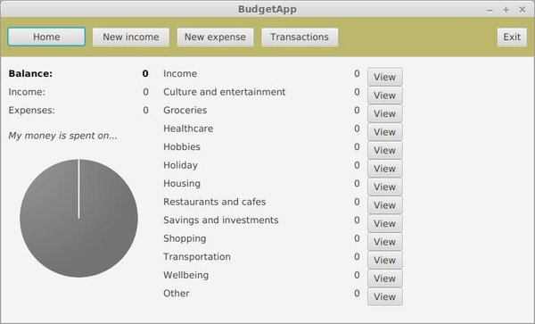
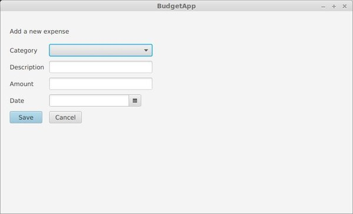
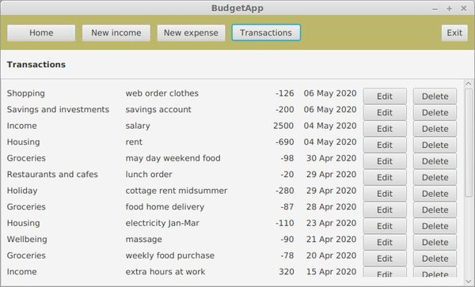

# Käyttöohje

Lataa sovelluksen uusin versio [releases-listasta](https://github.com/jmlii/ot-harjoitus/releases). Valitse tiedostoista jar-tiedosto, jonka nimi on muotoa BudgetApp-X.X.jar, ja lataa se koneellesi. X.X viittaa sovelluksen versionumeroon.

## Konfigurointi

Ohjelma olettaa, että sen käynnistyshakemistossa on konfiguraatiotiedosto config.properties, joka määrittelee tietokantayhteyden: tietokannan nimen, käyttäjätunnuksen ja salasanan. Tiedoston muoto on seuraava:
```
database = jdbc:h2:./budgetapp
username = sa
password = 
```
Ohjelma käyttää yhtäläisyysmerkin vasemmalla puolella olevia merkkijonoja etsiessään tiedostosta tietokannan tietoja, joten niitä ei tule muuttaa. Yhtäläisyysmerkin oikealla puolella on tietokannan tiedot, jotka voi vaihtaa, jos haluaa käyttää muuta tietokantaa. 

## Ohjelman käynnistäminen
Ohjelma käynnistetään komennolla 
```
java -jar BudgetApp-X.X.jar
```
, jossa X.X viittaa koneelle ladatun tiedoston nimessä oleviin numeroihin. Oletustietokantaa käyttämällä ohjelma luo käynnistämisen yhteydessä käynnistyshakemistoon tietokantatiedoston, jos sitä ei vielä ollut olemassa. Tätä tiedostoa ei tule poistaa, jos haluaa vielä käyttää käytön aikana tallentamiaan tietoja. Jos tiedot saa hävittää, niin tietokantatiedoston voi poistaa. Jos tietokantatiedoston on poistanut, niin ohjelma luo sen seuraavalla käynnistyskerralla uudelleen.

## Aloitusnäkymä
Sovellus avautuu näkymään, jossa käyttäjä näkee taloutensa kirjatut tulot, menot ja näiden tasapainon, sekä tapahtumien summat tapahtumakategorioittain. Kategorioiden kohdalta voi siirtyä tarkastelemaan kyseisen kategorian tapahtumia. Sovelluksen ylälaidassa on valikko, josta käyttäjä voi siirtyä kirjaamaan uuden tulon tai menon, tarkastelemaan kaikkia tapahtumia, tai exit-painikkeesta lopettaa ohjelman käytön. 

Sovelluksen aloitusnäkymä ensimmäisellä käynnistyskerralla, tai jos käyttäjä ei ole tallentanut sovellukseen mitään tietoja:



Sovelluksen aloitusnäkymä, kun sovellukseen on tallennettu tapahtumia: 


## Tapahtumat kategorioittain
Aloitusnäkymän oikeassa laidassa on listaus tapahtumakategorioista, ja kategorioittain summa koko kategorian tapahtumien arvosta. View-painikkeesta voi siirtyä tarkastelemaan halutun kategorian tapahtumia.

## Tulojen ja menojen summat ja talouden tasapaino
Aloitusnäkymän vasemmassa laidassa voi tarkastella talouden tasapainoa eli tulojen ja menojen välistä suhdetta, sekä kaikkien tulojen yhteenlaskettua arvoa ja kaikkien menojen yhteenlaskettua arvoa. 

## Uuden tulon tai menon lisääminen
Käyttäjä voi siirtyä kirjaamaan uuden tulon New income -painikkeesta, tai uuden menon New expense -painikkeesta. Painikkeista avautuu tietojensyöttölomake.

Tuloille on vain yksi kategoria, jonka ne saavat automaattisesti tapahtuman luomisen yhteydessä. Lomakkeella annetaan lisäksi tapahtumalle kuvaus (description), arvo (amount) kokonaislukuna ja tapahtuman päivämäärä (date). Tiedot tallennetaan Save-painikkeella. Lomakkeelta voi poistua tallentamatta tietoja Cancel-painikkeella.

Tulon lisääminen:


Menon lisääminen muistuttaa tulon lisäämistä, mutta menolle valitaan lisäksi kulukategoria Category-kohdan pudotusvalikosta. Ohjelmassa on valmiina 13 määriteltyä kulukategoriaa kattamaan tyypillisiä menoja. Menon arvo annetaan positiivisena kokonaislukuna, mutta ohjelma käsittelee sen tapahtumalistauksiinsa negatiiviseksi luvuksi.  

Menon lisääminen:



## Tapahtumalistaus
Transactions-painikkeesta pääsee tarkastelemaan kaikkia ohjelmaan kirjattuja tulo- ja menotapahtumia. Tapahtumat listautuvat aikajärjestyksessä, uusimmat ylimpänä. Kunkin tapahtuman kohdalta pääsee Edit-painikkeesta siirtymään tapahtuman tietojen muokkaamiseen, ja Delete-painikkeella tapahtuman voi poistaa. Muokkauslomakkeella voi muokata kaikkia muita tietoja, mutta tulokategoriaa ei voi vaihtaa menokategoriaksi, eikä menokategoriaa voi vaihtaa tulokategoriaksi.

Tapahtumalistaus:



## Ohjelman sulkeminen
Ohjelman käytön voi lopettaa sovelluksen ylälaidan valikon Exit-painikkeella. Painikkeen painaminen sulkee yhteyden tietokantaan ja ohjelmaan, mutta ei sulje sovellusikkunaa. Ohjelman voi sulkea myös suoraan käyttöjärjestelmän mukaisesta sovellusikkunansulkemispainikkeesta (esim. Linuxissa ja Windowsissa on tyypillisesti rasti sovellusikkunan oikeassa yläkulmassa). Tämä katkaisee yhteyden tietokantaan ja ohjelmaan.
