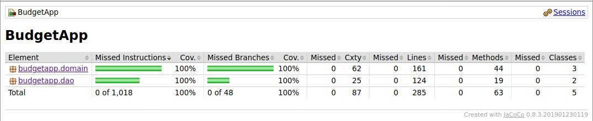

# Testausdokumentti

Ohjelman testaus on muodostunut JUnitilla tehdyistä automatisoiduista yksikkö- ja integraatiotesteistä sekä manuaalisesti tehdystä järjestelmän testaamisesta.

## Yksikkö- ja integraatiotestaus

Automatisoidut JUnit-testit testaavat niin sovelluslogiikkakerroksen luokkia BudgetService, Transaction ja Category, kuin dao-kerroksen luokkia SQLCategoryDao ja SQLTransactionDao. 

Sovelluslogiikan toimintaa testataan integraatiotestein luokassa BudgetServiceTest. Luokan testeissä on pyritty jäljittelemään käyttöliittymän kautta tehtäviä toimintoja, jotka sovellus pyytää BudgetService-luokan metodeja tekemään. Tietojen pysyväistalletukseen luotiin sovelluslogiikan testejä varten DAO-rajapinnat toteuttavat luokat FakeCategoryDao ja FakeTransactionDao, jotka tallentavat tiedot keskusmuistiin testien ajaksi, eivätkä säilytä niitä pysyvästi. Lisäksi testeissä testataan, että sovellus luo tarvitsemansa kategoriat käynnistyksen yhteydessä, jos ne puuttuvat käytöstä. 

TransactionTest- ja CategoryTest-luokat eivät sisällä monimutkaisia metodeja, joten niiden testit keskittyvät testaamaan erilaisten konstruktorien toimivuutta ja olioiden vertailtavuutta toisiinsa. 

Dao-luokat testaavat tietojen tallentamista tietokantaan ja noutamista sieltä. Testit käyttävät tilapäistä H2 in-memory-tietokantaa, joka pitää tiedot koneen muistissa vain testien ajan, ja testien päätyttyä tietokanta poistetaan. 

JUnit-testit eivät testaa käyttöliittymäkerrosta eivätkä sovelluksen suorituksen käynnistämiseen käytettävää Main-luokkaa. 

Testattujen kerrosten testien rivikattavuus ja haarautumakattavuus ovat 100%. 

## Järjestelmätestaus

Sovelluksen järjestelmätestaus on suoritettu manuaalisesti. Sovellus on haettu ja käynnisetty [käyttöohjeen](kayttoohje.md) ohjeistamalla tavalla Linux-ympäristössä. Sovelluksen käynnistyshakemistoon on tehty käyttöohjeen kuvauksen mukainen config.properties-tiedosto, jotta sovellus käynnistyy. Testatessa tarkistettiin, että sovellus ei käynnisty ilman kyseistä dokumenttia, tai jos dokumentissa ei ole käyttöohjeen mukaisia vaadittuja tekstejä. Sovellusta testatiin sekä ilman valmiiksi luotua tietokantaa että tietokannalla, jossa tietoa oli jo tallennettuna. 

Käyttäjä on testannut erilaisia käyttöskenaarioita käyttöliittymässä käymällä läpi [vaatimusmäärittelydokumentin](vaatimusmaarittely.md) ja käyttöohjeen kuvaamat toiminnallisuudet. Tapahtumien tallentamista ja muokkaamista on yritetty myös syöttämllä kenttiin virheellisiä arvoja. 

## Sovellukseen jääneet laatuongelmat

Sovellus ei anna selkeitä virheilmoituksia, jos sovellus ei käynnisty virheellisen konfiguraatiotiedoston vuoksi tai jos sitä ei ole tai sitä ei pystytä lukemaan. Selkeää virheilmoitusta ei ole määritelty siihenkään tilanteeseen, jos käyttäjä yrittää avata sovelluksesta useamman kuin yhden esiintymän samanaikaisesti samaa tietokantaa käyttäen tai tietokannan ollessa muun sovelluksen käytössä. 
